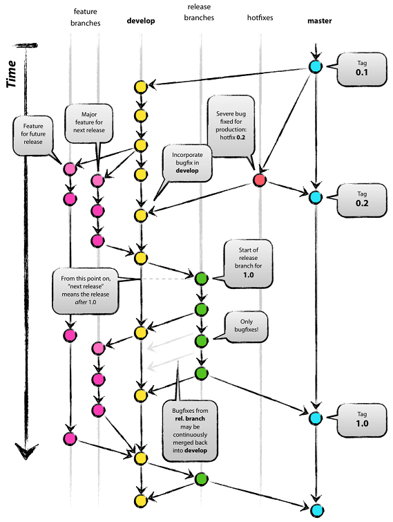

# Contributing

If you wish to contribute to this API, you must follow the following processes.

## Requirements

To contribute to the project you'll need a [GitHub](https://github.com/join?source=header-home) account.

## 1. Testing

Testing will be the most important part of your contribution as it will prevent you from breaking the working features of the API.

Unit and integration tests are written in `REST-in-peace\src\test\java\fr\univlorraine\gheintz\RESTinpeace`.

Run them by executing: `mvn test`

Unit tests are also run automatically before every commit with the `pre-coommit` git hook.

Whenever you add new features, please write the corresponding tests.

## 2. Git hooks

Git hooks are scripts that Git executes before or after events such as: commit, push, and receive.

The git hooks for this project are defined in the `hooks` directory.
Copy them in your `.git/hooks` directory when you first clone the project, and whenever they are updated.

In the `pre-coommit` hook, update the following lines to match your configuration:

```shell script
export JAVA_HOME="C:\Program Files\Java\jdk1.8.0_231"
export MAVEN_HOME="D:\apache-maven-3.6.3"
```

## 3. Language and encoding

All the code and the business of this API is written in **English** and the files are encoded in **UTF-8**.

## 4. Swagger

The swagger documentation is available at:
- https://groupe6.m2gi.win/swagger-ui.html in production
- http://localhost:8080/swagger-ui.html locally

To configure Swagger, see [SwaggerConfig](../../src/main/java/fr/univlorraine/gheintz/RESTinpeace/config/SwaggerConfig.java) in the ``fr.univlorraine.gheintz.RESTinpeace.config`` package.

## 5. SonarQube code inspection

During development, analyze your code with SonarQube by running

```shell
mvn sonar:sonar
```

SonarQube is also available at https://sonarqube.m2gi.win/dashboard?id=fr.univ-lorraine.gheintz%3AREST-in-peace

To configure SonarQube, see [sonar.properties](../../sonar.properties) at the root of the project.

## 6. Deploying the application

The easiest way to deploy the application is to use Jenkins by visiting : https://jenkins.m2gi.win/job/g6-projet/ and start a build. 

The application will then be publicly available on https://groupe6.m2gi.win/grave

## 7. Git Flow

Although we are not using the git-flow extension, the branches in this project must follow the git flow pattern.



We recommend using [GitKraken](https://www.gitkraken.com) to graphically visualize the branches and make this process easier.

## 8. Commit messages emojis


To avoid this bad example keep your commit messages informative at all times.

In order to help us all figure out what kind of changes have been made in each commit, please prepend your commit messages with an appropriate emoji from the following list:

|   Commit type              | Emoji                                         |
|:---------------------------|:----------------------------------------------|
| Initial commit             | :tada: `:tada:`                               |
| Version tag                | :bookmark: `:bookmark:`                       |
| New feature                | :sparkles: `:sparkles:`                       |
| Bugfix                     | :bug: `:bug:`                                 |
| Documentation              | :books: `:books:`                             |
| Performance                | :racehorse: `:racehorse:`                     |
| Tests                      | :rotating_light: `:rotating_light:`           |
| General update             | :zap: `:zap:`                                 |
| Refactor code              | :hammer: `:hammer:`                           |
| Removing code/files        | :fire: `:fire:`                               |
| Continuous Integration     | :green_heart: `:green_heart:`                 |
| Security                   | :lock: `:lock:`                               |
| Upgrading dependencies     | :arrow_up: `:arrow_up:`                       |
| Downgrading dependencies   | :arrow_down: `:arrow_down:`                   |
| Text                       | :pencil: `:pencil:`                           |
| Critical hotfix            | :ambulance: `:ambulance:`                     |
| Deploying stuff            | :rocket: `:rocket:`                           |
| Work in progress           | :construction:  `:construction:`              |
| Removing a dependency      | :heavy_minus_sign: `:heavy_minus_sign:`       |
| Adding a dependency        | :heavy_plus_sign: `:heavy_plus_sign:`         |
| Docker                     | :whale: `:whale:`                             |
| Configuration files        | :wrench: `:wrench:`                           |
| Merging branches           | :twisted_rightwards_arrows: `:twisted_rightwards_arrows:` |
| Reverting changes          | :rewind: `:rewind:`                           |
| Breaking changes           | :boom: `:boom:`                               |
| Code review changes        | :ok_hand: `:ok_hand:`                         |
| Move/rename repository     | :truck: `:truck:`                             |
| Other                      | [Be creative](http://www.emoji-cheat-sheet.com/)  |

## 9. Updating the documentation
   
If you add new features, or have problems following the existing documentation, please update them accordingly (in English and French).