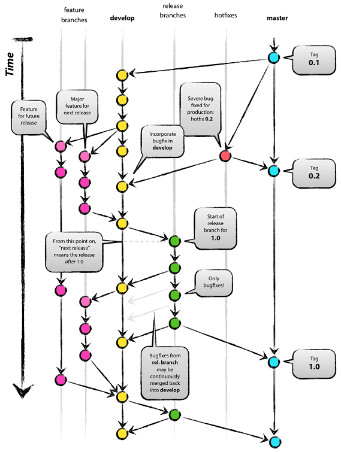

# Contribuer au projet

Si vous souhaitez contribuer à cette API, vous devrez suivre les processus suivants.

## Prérequis

Pour contribuer au projet vous aurez besoin d'un compte [GitHub](https://github.com/join?source=header-home).

## 1. Tester le code

Les tests seront la partie la plus importante de votre contribution puisqu'ils permettront de s'assurer que vous ne modifiez pas le comportement normal de l'API.

Les tests unitaires et d'intégration sont écrits dans le dossier `REST-in-peace\src\test\java\fr\univlorraine\gheintz\RESTinpeace`.

Vous pouvez les exécuter avec : `mvn test`

Les tests unitaires sont aussi exécutés automatiquement avant chaque commit grâce au hook de `pre-coommit`. 

Lorsque vous ajoutez de nouvelles fonctionnalités, veuillez aussi ajouter les tests correspondants.

## 2. Git hooks

Les "Git hooks" sont des scripts que Git exécute avant ou après des évènements tels que :  commit, push, et receive

Le hook de `pre-coommit` mis en place dans ce projet empêche de "commiter" du code qui ne compile pas et ne passe pas les tests unitaires.

Les hooks sont définis dans le dossier `hooks`
Copiez-les dans votre réperoire `.git/hooks` à la racine du projet quand vous clonez le code pour la première fois et lorsque les hooks sont mis à jour.

Dans le hook `pre-coommit` modifiez le lignes suivantes pour les faire correspondre à votre configuration :

```shell script
export JAVA_HOME="C:\Program Files\Java\jdk1.8.0_231"
export MAVEN_HOME="D:\apache-maven-3.6.3"
```

## 3. Langue et encodage

Tout le code et la logique métier de cette API est écrit en **Anglais** et les fichiers sont encodés en **UTF-8**.

## 4. Swagger

La documentation Swagger de l'API est disponible à :
- https://groupe6.m2gi.win/swagger-ui.html en production
- http://localhost:8080/swagger-ui.html sur votre installation locale

Pour configurer Swagger, voir [SwaggerConfig](../../src/main/java/fr/univlorraine/gheintz/RESTinpeace/config/SwaggerConfig.java) dans le package ``fr.univlorraine.gheintz.RESTinpeace.config``.

## 5. Inspection du code avec SonarQube

Pendant le développement, analysez votre code avec SonarQube grâce à la commande

```shell
mvn sonar:sonar
```

SonarQube est aussi disponible après le déploiement à l'adresse suivante :
https://sonarqube.m2gi.win/dashboard?id=fr.univ-lorraine.gheintz%3AREST-in-peace

Pour configurer SonarQube, voir [sonar.properties](../../sonar.properties) à la racine du projet.

## 6. Déployer l'application

#### Déploiement manuel

Le moyen le plus simple de déployer l'application en production est d'utiliser Jenkins à l'adresse suivante : https://jenkins.m2gi.win/job/g6-projet/ et de démarrer un "build".

L'application sera alors publiquement disponible à l'adresse https://groupe6.m2gi.win/grave

#### Automatisation avec les web hook GitHub

Un web hook a été activé sur le dépôt GitHub du projet.
Cela signifie que tout push sur la branche master déclenchera un build sur Jenkins, qui déploiera automatiquement l'application en production.

## 7. Git Flow

Bien que ce projet n'utilise pas l'extension git-flow, les branches doivent suivre les recommandations de git flow afin d'être ordonnées.



De plus, l'utilisation de [GitKraken](https://www.gitkraken.com) est recommandée afin de disposer d'une vue graphique des branches et de faciliter ce processus.

## 8. Emojis dans les messages de commits


Pour éviter de se retrouver dans le cas ci-dessous, faites en sorte que vos messages de commit soient toujours informatifs.

Afin de nous aider à comprendre les changements effectués dans chaque commit, veuillez ajouter un emoji au début de vos messages de commit.

|   Commit type                 | Emoji                                         |
|:------------------------------|:----------------------------------------------|
| Premier commit                | :tada: `:tada:`                               |
| Tag de version                | :bookmark: `:bookmark:`                       |
| Nouvelle fonctionnalité       | :sparkles: `:sparkles:`                       |
| Correction de bug             | :bug: `:bug:`                                 |
| Documentation                 | :books: `:books:`                             |
| Performance                   | :racehorse: `:racehorse:`                     |
| Tests                         | :rotating_light: `:rotating_light:`           |
| Mise à jour générale          | :zap: `:zap:`                                 |
| Refactorisation du code       | :hammer: `:hammer:`                           |
| Suppression de code/fichiers  | :fire: `:fire:`                               |
| Integration Continue          | :green_heart: `:green_heart:`                 |
| Sécurité                      | :lock: `:lock:`                               |
| Mise à jour des dependences   | :arrow_up: `:arrow_up:`                       |
| Rétrogradation de dépendances | :arrow_down: `:arrow_down:`                   |
| Texte                         | :pencil: `:pencil:`                           |
| Correction critique           | :ambulance: `:ambulance:`                     |
| Deploiement                   | :rocket: `:rocket:`                           |
| Travail en cours              | :construction:  `:construction:`              |
| Suppression de dépendance     | :heavy_minus_sign: `:heavy_minus_sign:`       |
| Ajout de dépendance           | :heavy_plus_sign: `:heavy_plus_sign:`         |
| Docker                        | :whale: `:whale:`                             |
| Configuration                 | :wrench: `:wrench:`                           |
| Fusion de branches            | :twisted_rightwards_arrows: `:twisted_rightwards_arrows:` |
| Annulation de changements     | :rewind: `:rewind:`                           |
| Gros changements              | :boom: `:boom:`                               |
| Changements après code review | :ok_hand: `:ok_hand:`                         |
| Déplacements/renommages       | :truck: `:truck:`                             |
| Autres                        | [Soyez créatifs](http://www.emoji-cheat-sheet.com/)  |

## 9. Mise à jour des documentations

Si vous ajoutez de nouvelles fonctionnalités, ou que vous rencontrez des problèmes en suivant la documentation existante,
veuillez mettre à jour la documentation en conséquence (en anglais et en français).
